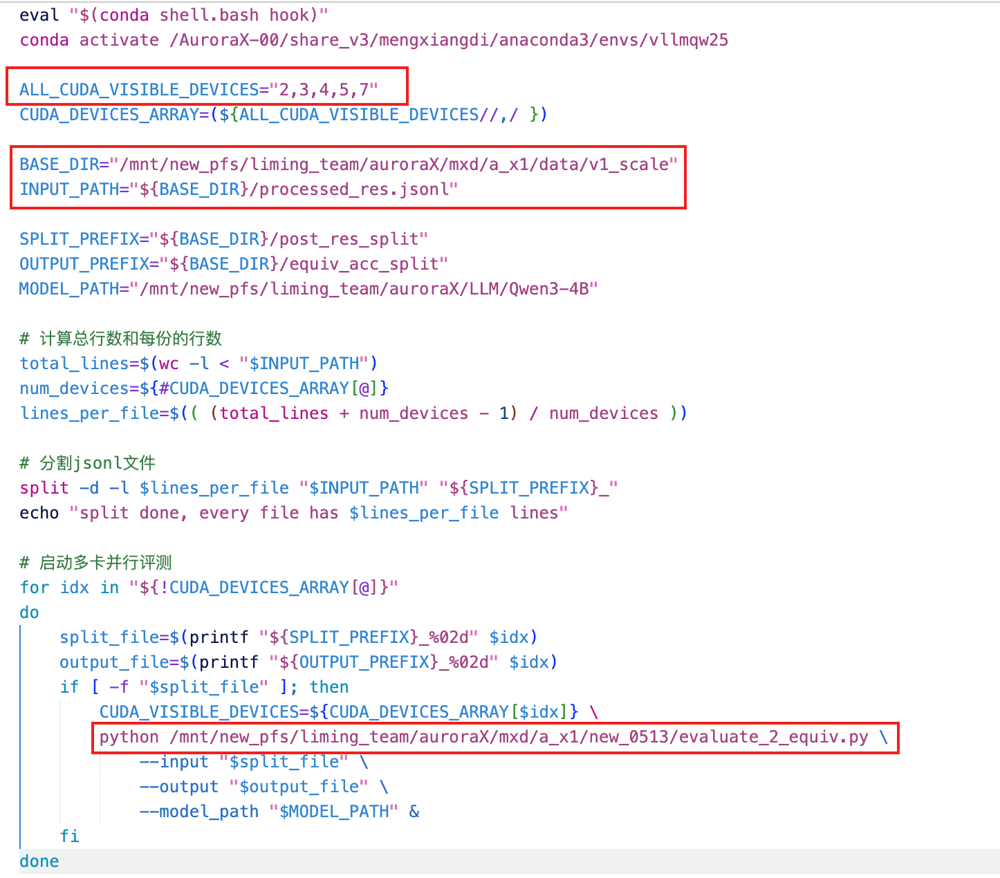

# rollout
rollout_verify/evaluate_1_pre_data.py
该文件的目的是对于数据集先进行划分，这个份数影响了后续的cuda设备指定
rollout_verify/scripts/rollout_2.sh
设定cuda可视设备即可

# evaluate
整体的输入输出解析
输入的数据是jsonl形式，每一行必须有 final_answer 和 answer这两个key，其中answer是ground truth，final_answer是待评价的答案
输出的每一个值则是每一组的avg@k
所以注意cuda设备的数量，不要影响到划分，--> 每一份都应该是k的整数倍

会根据你给出的可用cuda设备，将所有的输入数据划分对应数量的份数
需要注意的是 设备数目影响划分数目影响评测